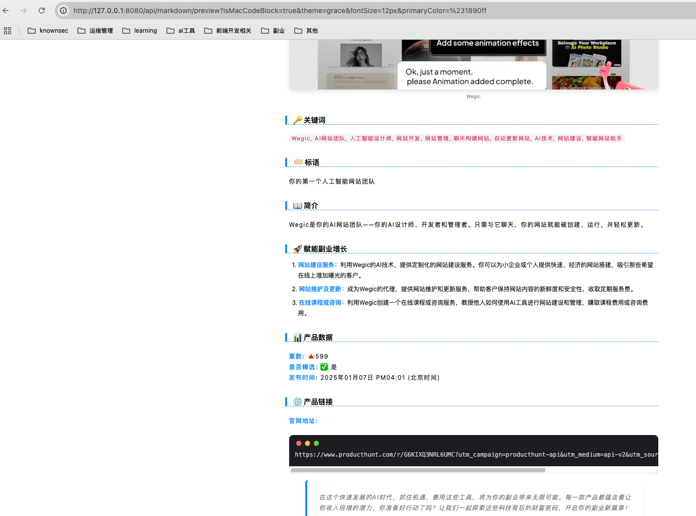

# Media Assistant API

[English](README.en.md) | 简体中文

Media Assistant API 是一个功能强大的 Markdown 转 HTML 服务，致力于提供美观且可定制的内容转换能力。支持多种高级特性，让 Markdown 内容转换更灵活、更专业。

👉 在线体验：[点击前往](https://md.openwrite.cn/)

---

## 📝 开发计划（TODO）

### 🎨 功能增强

* ✅ 支持更多 Markdown 扩展语法
* ✅ 添加多种预设主题
* ✅ 动态样式切换
* ✅ 自定义字体与样式
* ✅ 支持自定义 CSS 与代码高亮主题
* ⬜ 增加图片处理功能（压缩、水印等）
* ⬜ 支持导出 PDF 格式

### 📚 文档完善

* ✅ 提供完整的 API 使用示例
* ⬜ 编写贡献指南
* ⬜ 补充常见问题解答（FAQ）
* ✅ 提供在线演示环境

---

## ✨ 核心特性

### 🎨 自定义主题样式

* 配置字体、颜色、间距等参数
* 支持暗黑模式
* 提供多套主题，支持自定义 CSS 覆盖

### 📊 Mermaid 图表支持

* 流程图、时序图、甘特图、类图等

### ✍️ 数学公式支持（KaTeX）

* 行内与块级公式
* 完整支持 KaTeX 语法

### 🎯 自定义提示框

* 支持信息、警告、错误、成功四种提示类型

### 💫 Mac 风格代码块

* 高亮、行号、复制按钮、语言标识

### 🔗 脚注与引用链接支持

### 📱 响应式设计，完美适配移动端

### 🎈 轻量部署，快速上手

---

## 📦 API 接口说明

### Markdown 转 HTML

* **接口路径**：`POST /markdown/html`
* **请求头**：`Content-Type: application/json`
* **请求体**：

```json
{
  "data": "# Markdown 内容",           // 必填
  "isMacCodeBlock": true,               // 启用 Mac 风格代码块（可选）
  "theme": "default",                  // 主题名称：default、grace（可选）
  "fontFamily": "无衬线",              // 字体类型：无衬线、衬线、等宽（可选）
  "fontSize": "15px",                 // 字体大小（例如：14px）（可选）
  "isUseIndent": true,                 // 是否启用缩进（可选）
  "primaryColor": "#1890ff",          // 主色调（可选）
  "citeStatus": true,                  // 是否启用引用（可选）
  "legend": "只显示 title",            // 图例样式（可选）
  "codeTheme": "1c-light"             // 代码高亮主题（可选）
}
```

* **响应示例**：

```json
{
  "status": "success",
  "data": {
    "html": "<div class='markdown-body'>...转换后的HTML内容...</div>"
  }
}
```

### 支持的代码高亮主题
| 主题名                   | 异名          | 风格描述                     |
| ------------------------ | --------------- | ---------------------------- |
| 1c-light                 | 1C 浅色         | 适合 1C 风格，浅色明快       |
| a11y-dark                | 无障碍深色      | 高对比度，适合无障碍阅读     |
| a11y-light               | 无障碍浅色      | 高对比度浅色主题             |
| agate                    | 玛瑙            | 深色柔和风格                 |
| an-old-hope              | 旧希望          | 深色带蓝调，灵感自 Star Wars |
| androidstudio            | 安卓工作室      | Android Studio 编辑器配色    |
| arduino-light            | Arduino 浅色    | Arduino IDE 风格             |
| arta                     | 艺术            | 亮色对比强烈，艺术感强       |
| ascetic                  | 简朴            | 极简无背景，干净清爽         |
| atom-one-dark-reasonable | Atom 合理深色   | 基于 Atom 编辑器，优化对比度 |
| atom-one-dark            | Atom 深色       | 经典 Atom 编辑器深色主题     |
| atom-one-light           | Atom 浅色       | 经典 Atom 编辑器浅色主题     |
| brown-paper              | 牛皮纸          | 牛皮纸质感，复古风格         |
| codepen-embed            | CodePen 嵌入    | CodePen 风格，适合嵌入展示   |
| color-brewer             | 调色盘          | 多色对比，颜色层次丰富       |
| dark                     | 深色            | 纯深色基础主题               |
| default                  | 默认            | highlight.js 默认风格        |
| devibeans                | 豆子风格        | 暗色对比强，简洁             |
| docco                    | 文档风          | 类似文档排版，阅读性好       |
| far                      | FAR 管理器      | 仿 FAR 管理器界面风格        |
| felipec                  | Felipe 风格     | 个人化强，带色彩对比         |
| foundation               | Foundation      | 基于 Foundation 框架主题     |
| github-dark-dimmed       | GitHub 暗淡     | GitHub 暗色低亮度版          |
| github-dark              | GitHub 深色     | GitHub 官方深色主题          |
| github                   | GitHub          | GitHub 官方默认浅色主题      |
| gml                      | GML             | GameMaker 风格               |
| googlecode               | Google Code     | Google Code 的配色           |
| gradient-dark            | 渐变深色        | 背景带渐变，炫酷深色         |
| gradient-light           | 渐变浅色        | 渐变浅色，现代感强           |
| grayscale                | 灰度            | 灰阶风格，护眼极简           |
| hybrid                   | 混合风格        | 混搭多种颜色，风格中性       |
| idea                     | IntelliJ IDEA   | JetBrains 风格深色主题       |
| intellij-light           | IntelliJ 浅色   | JetBrains 系列浅色风格       |
| ir-black                 | IR 黑           | 黑底亮字，经典 hacker 风     |
| isbl-editor-dark         | ISBL 深色       | ISBL 编辑器深色样式          |
| isbl-editor-light        | ISBL 浅色       | ISBL 编辑器浅色样式          |
| kimbie-dark              | Kimbie 深色     | 暗黄+棕调，复古风格          |
| kimbie-light             | Kimbie 浅色     | 柔和黄棕调                   |
| lightfair                | 明亮公平        | 明亮整洁，带蓝调             |
| lioshi                   | Lioshi 风格     | 设计感强，深色个性主题       |
| magula                   | 马古拉          | 明亮且不刺眼                 |
| mono-blue                | 单蓝色          | 蓝色为主色调，冷色风         |
| monokai-sublime          | Sublime Monokai | Sublime Text 配色            |
| monokai                  | 莫诺凯          | 经典编辑器配色，深色高对比   |
| night-owl                | 夜猫子          | 深色，蓝绿调护眼主题         |
| nnfx-dark                | NNFX 深色       | 黑底低亮度护眼色             |
| nnfx-light               | NNFX 浅色       | 护眼绿色浅色主题             |
| nord                     | 北极光          | 冰蓝色调，柔和不刺眼         |
| obsidian                 | 黑曜石          | 类 Obsidian 软件深色主题     |
| panda-syntax-dark        | 熊猫深色        | 高饱和色彩，适合夜间编码     |
| panda-syntax-light       | 熊猫浅色        | 明亮清晰，略带彩色高亮       |
| paraiso-dark             | 天堂深色        | 紫蓝柔和配色                 |
| paraiso-light            | 天堂浅色        | 柔和浅色主题                 |
| pojoaque                 | 波霍阿克        | 复古卷轴风格                 |
| purebasic                | PureBasic 风格  | 蓝底白字，PureBasic IDE 风格 |
| qtcreator-dark           | QtCreator 深色  | Qt 开发工具深色配色          |
| qtcreator-light          | QtCreator 浅色  | 浅色 Qt 编辑器风格           |
| rainbow                  | 彩虹            | 色彩丰富，适合演示           |
| routeros                 | RouterOS        | MikroTik RouterOS 控制台风格 |
| school-book              | 课本风          | 类教材注释风格               |
| shades-of-purple         | 紫色阴影        | 紫色调，视觉冲击强           |
| srcery                   | Srcery 风格     | 对比强烈，红调突显           |
| stackoverflow-dark       | SO 深色         | StackOverflow 深色主题       |
| stackoverflow-light      | SO 浅色         | StackOverflow 浅色主题       |
| sunburst                 | 阳光爆发        | 黑底黄红字，炫彩风格         |
| tokyo-night-dark         | 东京夜晚        | 蓝紫调，二次元夜间风格       |
| tokyo-night-light        | 东京日间        | 对应明亮版，日系清新风       |
| tomorrow-night-blue      | 明日夜蓝        | 蓝底亮字，未来感强           |
| tomorrow-night-bright    | 明日夜亮        | 明亮对比版                   |
| vs                       | Visual Studio   | VS 浅色风格                  |
| vs2015                   | VS2015 深色     | Visual Studio 2015 风格      |
| xcode                    | Xcode           | macOS Xcode 编辑器配色       |
| xt256                    | XT256           | 终端风格，16/256色           |

### 🖼️ Markdown 示例预览

* **接口路径**：`GET /markdown/preview`
* **支持参数**：同上
* **响应**：返回 HTML 页面，内含预览效果

示例图：


---

## 🚀 快速开始

```bash
# 克隆仓库
git clone git@github.com:code-innovator-zyx/media-assistant-api.git
cd media-assistant-api

# 安装依赖
pnpm install

# 启动开发服务
pnpm dev
```

---

## 🛠️ 配置说明

### 环境变量

在根目录创建 `.env` 文件：

```env
PORT=3000
NODE_ENV=development
```

### 默认主题配置

在 `src/config/theme.ts` 中自定义：

```ts
export const themes = {
  default: {
    fontSize: '16px',
    lineHeight: '1.6',
    // 更多配置...
  },
  dark: {
    // 暗黑主题配置
  }
}
```

---

## 📌 示例调用（Python）

```python
def parse_html(md: str):
    params = {
        "data": md,
        "isMacCodeBlock": False,
        "fontSize": "14px"
    }
    res = requests.post(
        url="http://localhost:8080/api/markdown/html",
        data=json.dumps(params),
        headers={"Content-Type": "application/json"}
    )
    res.raise_for_status()
    return res.json()["data"]
```

---

## 🤝 贡献指南

1. Fork 本项目
2. 新建分支：`git checkout -b feature/你的功能名称`
3. 提交更改：`git commit -m '添加功能说明'`
4. 推送分支：`git push origin feature/你的功能名称`
5. 发起 Pull Request

---

## 📄 开源协议

本项目遵循 [MIT](LICENSE) 协议开源，欢迎使用与贡献！
